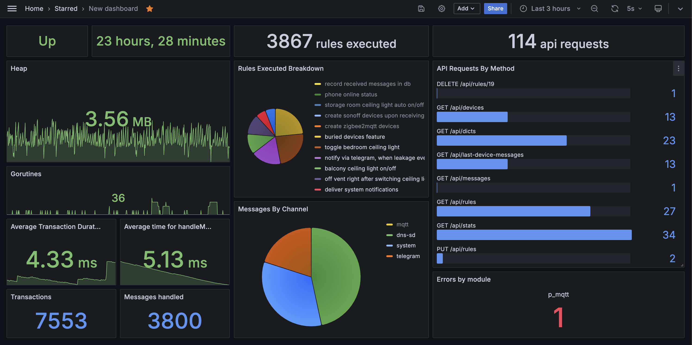

### Project «mhz19-go»

This project is backend for the home automation server, written on golang. Evolution of another myne project [mhz19-next](https://github.com/fedulovivan/mhz19-next) which was a typescript-based. 

### Real use cases

- Switch smart ceiling light on/off upon receiving message from smart wall switch
- Automatically switch storage room light upon receiving message from movement sensor
- Automatically switch storage room ventilation, when movement sensor reports a man presense and room door sensor reports it is closed
- Play loud alert sound, notify owner via telegram and cut off home water supply upon receiving message from one of water leakage sensors
- Notify owner then some guarded door (equipped with smart sensor) was opened/closed and user is not at home

See full list of configured rules: [user rules](https://github.com/fedulovivan/mhz19-go/tree/main/assets/rules/user) and [system rules](https://github.com/fedulovivan/mhz19-go/tree/main/assets/rules/system)

### Project goal

- Create pure offline, vendor agnostic and fully controlled local home automation server
- Bring project to modern stack and learn golang while project migration from typescript

### Applied best practices

- Source code organisation folows SOLID/clean-architecture recommendations
- DI to enable better UTs coverage
- Folders layout in accordance with [project-layout](https://github.com/golang-standards/project-layout)
- With unit tests, race tests and code coverage stats enabled
- Sql schema and basic data migrations support
- Load tests for the REST API
- Race tests
- Collecting prometheus metrics, configured prometheus and dashboard in grafana 
- Makefile for the common developer tasks and docker-compose file to deploy app with additional tooling (prometheus, grafana)
- Backlog with TODOs

### Architecture

- Channel providers which collect messages from different channels and devices into unified stream. Supported channels are mqtt, telegram, dns-sd, sonoff (TBD) and yeelight (TBD).
- History storage which persist received messages in sqlite db
- Versatile mapping rules Engine which defines how application should respond to received messages
- Actions executor which executes one or more actions in respond to received message
- REST API layer to manage application: create rules, read device messages history, read registered devices
- Telegram as a channel to delivery various notifications and alerts and remote controll
- Docker compose to deploy entire server, which consists of this [backend](https://github.com/fedulovivan/mhz19-go), frontend (TBD), [device-pinger](https://github.com/fedulovivan/device-pinger) service, [eclipse mosquitto](https://mosquitto.org/) as mqtt message broker, [zigbee2mqtt](https://www.zigbee2mqtt.io/) zigbee bridge, metrics database [prometheus](https://prometheus.io/) and [grafana](https://grafana.com/) for metrics visualization.

### Unified message structure

No matter which channel was used to receive a message, or which certain device has emitted that message, we pack every message into unified strusture to be handled by Engine.
- Channel type - mqtt, telegram, dns-sd, sonoff, yeelight
- Device class - zigbee device, zigbee bridge, device-pinger, valve-manipulator, telegram-bot, sonoff diy-plug device, yeelight device
- Device id - unique device identifier, specific for the certain device class. e.g. zigbee ieee device address 0x00158d0004244bda or device IP
- Payload - the message itself as a json. untyped, specific for the certain device and channel. e.g. zigbee wall switch message may look like `{"battery":100,"action":"single_left"}` or telegram-bot message as `{"Text":"/open-valves"}`
- Timestamp - a time when message was received by the server, usefull when reading and visualizing historical data

### Used technologies

- [golang](https://go.dev/) as main app language
- [sqlite3](https://www.sqlite.org/) with [go-sqlite3](github.com/mattn/go-sqlite3) client as a persistent storage
- [ozzo-routing](github.com/go-ozzo/ozzo-routing/v2) http routing
- [godotenv](github.com/joho/godotenv) and [go-envconfig](github.com/sethvargo/go-envconfig) as configuration layer
- [eclipse paho](github.com/eclipse/paho.mqtt.golang) as mqtt client
- [docker](https://www.docker.com/) for containerization
- [Makefile](./blob/main/Makefile) for developer routine automation
- [telegram bot api](https://core.telegram.org/bots/api) with [client](https://github.com/go-telegram-bot-api/telegram-bot-api) for the notifications and remote management
- [dnssd](https://github.com/brutella/dnssd) as mdns client (sonoff smart devices discovery)
- [gabs](https://github.com/Jeffail/gabs) as json querier

### Demo

### Migrations, schema version validation

- `make migrate-reset` - execute all down migrations and then all up migrations, basically reset schema to its default empty state
- `make migrate-down` - execute all down migrations
- `make migrate-up` - execute all up migrations
- `make migrate-up-single` - run certain migration up
- `make migrate-down-single` - run certain migration down
- `make migrate-dump` - create current schema dump

### Load tests

- `make api-load-rules-read`
- `make api-load-rules-write`
- `make api-load-push-message-write`

### Starting development instance

- create db and run all migrations `make migrate-up` or reset to inital state with `make migrate-reset`
- create config file from sample `cp .env.sample .env`
- optionally: run tests with `make test`
- run application `make run`

### Deploying production instance

- create db and run all migrations `make migrate-up`
- create config file from sample `cp .env.sample .env`
- build image with `make docker-build`
- create and run container `make docker-up`
- optionally: check logs with `make docker-logs`

### Entities provisioning

`DIR=devices make provision`
`DIR=rules/system make provision`
`DIR=rules/user make provision`

### Tools required for the development on the bare host

- go `wget https://go.dev/dl/go1.23.0.linux-amd64.tar.gz`, `rm -rf /usr/local/go && tar -C /usr/local -xzf go1.23.0.linux-amd64.tar.gz`, `export PATH=$PATH:/usr/local/go/bin`
- golangci-lint https://golangci-lint.run/welcome/install `curl -sSfL https://raw.githubusercontent.com/golangci/golangci-lint/master/install.sh | sh -s -- -b $(go env GOPATH)/bin v1.60.3`
- gcc `sudo apt install gcc`
- delve `go install -v github.com/go-delve/delve/cmd/dlv@latest`
- sqlite3 `sudo apt-get install sqlite3`
- oha `brew install oha`

### Usefull commands

run and view logs for selected module only `make run 2>&1 >/dev/null | grep "engine"`
scp log `scp ivanf@192.168.88.188:/home/ivanf/Projects/mhz19-go/log.txt ~/Desktop`

### Profiling

- run cpu and memory benchmark for single unit test and save two profiles accordingly
`make bench`
- open cpu profile in pprof
`make pprof-cpu`
- open memory profile in pprof
`make pprof-mem`
- inside pprof: see top N records
`top`
- inside pprof: open top N graph in browser
`web`
- inside pprof: see memory allocation for certain function
`list Test31`
- collect 10s cpu profile from running app
`curl --location 'http://localhost:7070/debug/pprof/profile?seconds=10' > back_cpu.prof`
- collect 10s head allocations profile from running app
`curl --location 'http://localhost:7070/debug/pprof/heap?seconds=10' > back_heap.prof`
- open heap snapshot in text format in browser
`http://localhost:7070/debug/pprof/heap?debug=1`
- open local cpu profile in pprof web version
`go tool pprof -http=:7272 back_cpu.prof`
- open remote heap profile in local pprof web version
`go tool pprof -http=:7272 http://192.168.88.188:7070/debug/pprof/heap`
- open remote cpu profile in local pprof web version
`go tool pprof -http=:7272 http://192.168.88.188:7070/debug/pprof/profile`
- list of available profilers
`http://localhost:7070/debug/pprof`

### Database schema

- **rules** - TBD
- **rule_conditions** - TBD
- **rule_actions** - TBD
- **rule_condition_or_action_arguments** - TBD
- **rule_action_argument_mappings** - TBD
- **condition_functions** - TBD
- **action_functions** - TBD
- **device_classes** - TBD
- **channel_types** - TBD
- **devices** - TBD
- **messages** - TBD
- **schema_version** - since v1, TBD